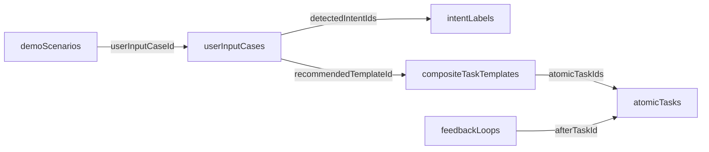

# Data Contract

本仓库主数据由 `data/` 下 6 个 JSON 文件组成。每个文件顶层必须是数组，每个对象必须有唯一 `id`。

## `userInputCases.json`

用户输入案例，描述系统收到什么输入以及应如何分类。

字段：

- `id`: string
- `title`: string
- `inputType`: `text` | `image` | `image_text`
- `userText`: string，图片-only 场景可以为空字符串
- `imagePath`: string，可选；推荐前端根路径格式，例如 `/assets/screenshots/math-video-001.svg`
- `subject`: string，可选
- `detectedIntentIds`: string[]，非空，指向 `intentLabels.id`
- `taskType`: `simple_atomic_task` | `complex_composite_task` | `ambiguous_task` | `emergency_task` | `multimodal_task`
- `urgency`: `low` | `medium` | `high`
- `needsClarification`: boolean
- `recommendedTemplateId`: string，可选，指向 `compositeTaskTemplates.id`
- `expectedOutput`: string

## `intentLabels.json`

意图标签库。

字段：

- `id`: string
- `name`: string
- `description`: string

必须覆盖识别内容、理解知识点、解题、临考救急、任务拆解、制定计划、澄清目标、判断优先级、估算时间、生成反馈、压缩任务范围、调整学习路径、错题整理、多模态理解。

## `atomicTasks.json`

元任务库。它不是题库条目，而是 AI 编排器可以选择和排序的最小任务单元。

字段：

- `id`: string
- `name`: string
- `description`: string
- `difficulty`: `low` | `medium` | `high`
- `estimatedMinutes`: number，必须为正数
- `inputNeeded`: string
- `completionCriteria`: string
- `failureRisk`: string

## `compositeTaskTemplates.json`

组合任务模板，由多个元任务组成。

字段：

- `id`: string
- `name`: string
- `triggerConditions`: string[]，非空
- `atomicTaskIds`: string[]，非空，全部指向 `atomicTasks.id`
- `estimatedTotalMinutes`: number，必须为正数
- `difficulty`: `low` | `medium` | `high`
- `outputGoal`: string

## `feedbackLoops.json`

反馈闭环数据，描述某个元任务之后如何判断用户是否能继续。

字段：

- `id`: string
- `afterTaskId`: string，指向 `atomicTasks.id`
- `question`: string
- `positiveNextAction`: string
- `negativeNextAction`: string

反馈必须具体，不能写成“继续努力”“再试试看”“保持学习”。

## `demoScenarios.json`

前端 Demo 流程脚本。

字段：

- `id`: string
- `title`: string
- `userInputCaseId`: string，指向 `userInputCases.id`
- `flow`: string[]，非空，必须体现用户输入、意图识别、任务类型判断、是否追问、任务拆解、难度时间评估和反馈闭环
- `demoHighlight`: string

## ID 关系

## 图片路径规则

`imagePath` 可以使用 `/assets/screenshots/...` 这种前端根路径。校验脚本会把它解析到仓库内的 `assets/screenshots/...`。

图片缺失只会产生 warning，不会让校验失败。这样可以先完成数据结构，再补齐素材。
