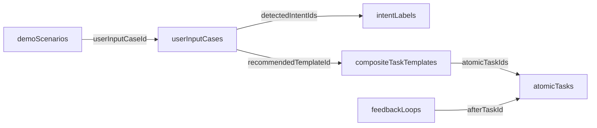

# Frontend Integration

This repository is a static data source. A frontend should read the six core JSON files directly and assemble a view model by resolving IDs.

## JSON Files to Read

- `data/userInputCases.json`
- `data/intentLabels.json`
- `data/atomicTasks.json`
- `data/compositeTaskTemplates.json`
- `data/feedbackLoops.json`
- `data/demoScenarios.json`

Do not use `data/demo-cases.json` for new UI work. It is a legacy snapshot.

## How Pages Use the Data

- Demo selector: list `demoScenarios`.
- User input panel: resolve `demoScenario.userInputCaseId` to one `userInputCase`.
- Intent chips: resolve `userInputCase.detectedIntentIds` to `intentLabels`.
- Task template panel: resolve `userInputCase.recommendedTemplateId` to one `compositeTaskTemplate`.
- Task breakdown: resolve `compositeTaskTemplate.atomicTaskIds` to ordered `atomicTasks`.
- Feedback panel: filter `feedbackLoops` where `afterTaskId` appears in selected atomic tasks.

## ID Relationship Graph



## Import Example

```ts
import userInputCases from "../data/userInputCases.json";
import intentLabels from "../data/intentLabels.json";
import atomicTasks from "../data/atomicTasks.json";
import compositeTaskTemplates from "../data/compositeTaskTemplates.json";
import feedbackLoops from "../data/feedbackLoops.json";
import demoScenarios from "../data/demoScenarios.json";
```

## `assembledDemo` Example

```ts
const scenario = demoScenarios[0];
const userInputCase = userInputCases.find((item) => item.id === scenario.userInputCaseId);

const intents = userInputCase
  ? intentLabels.filter((intent) => userInputCase.detectedIntentIds.includes(intent.id))
  : [];

const template = userInputCase?.recommendedTemplateId
  ? compositeTaskTemplates.find((item) => item.id === userInputCase.recommendedTemplateId)
  : undefined;

const tasks = template
  ? template.atomicTaskIds
      .map((taskId) => atomicTasks.find((task) => task.id === taskId))
      .filter(Boolean)
  : [];

const taskIds = new Set(tasks.map((task) => task.id));
const feedback = feedbackLoops.filter((loop) => taskIds.has(loop.afterTaskId));

export const assembledDemo = {
  scenario,
  userInputCase,
  intents,
  template,
  tasks,
  feedback
};
```

## Frontend Acceptance Criteria

- The UI can render at least five demo scenarios from static JSON.
- Selecting a scenario shows the input case, intent labels, task type, urgency, and expected output.
- The selected template renders ordered atomic tasks with difficulty and estimated minutes.
- Feedback loops appear only when their `afterTaskId` is in the selected task list.
- Missing image assets do not crash the UI; they fall back to a placeholder.
- The frontend does not require a backend or live AI service.
