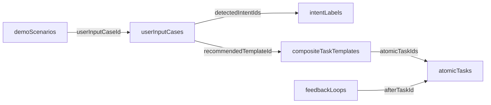

# Frontend Integration

前端只需要读取静态 JSON，不需要后端、数据库或真实 AI API。

## 需要读取的 JSON

- `data/userInputCases.json`
- `data/intentLabels.json`
- `data/atomicTasks.json`
- `data/compositeTaskTemplates.json`
- `data/feedbackLoops.json`
- `data/demoScenarios.json`

不要把 `data/demo-cases.json` 作为新页面入口；它只是 legacy 快照。

## 页面如何使用数据

- Demo 入口页：读取 `demoScenarios`，展示可选 Demo。
- 用户输入识别页：用 `demoScenario.userInputCaseId` 读取输入案例，展示 `inputType`、`userText`、`imagePath`、`urgency`。
- 意图识别页：用 `detectedIntentIds` 找到 `intentLabels` 并渲染标签。
- 任务拆解页：用 `recommendedTemplateId` 找到组合模板，再用 `atomicTaskIds` 找到元任务列表。
- 反馈闭环页：过滤 `feedbackLoops.afterTaskId` 属于当前元任务列表的反馈。
- 最终计划页：汇总模板目标、元任务耗时、难度、完成标准和下一步。

## ID 关系图



## import 示例

```ts
import userInputCases from "../data/userInputCases.json";
import intentLabels from "../data/intentLabels.json";
import atomicTasks from "../data/atomicTasks.json";
import compositeTaskTemplates from "../data/compositeTaskTemplates.json";
import feedbackLoops from "../data/feedbackLoops.json";
import demoScenarios from "../data/demoScenarios.json";
```

## assembledDemo 组装示例

```ts
const scenario = demoScenarios[0];
const userInputCase = userInputCases.find((item) => item.id === scenario.userInputCaseId);

const detectedIntents = userInputCase
  ? userInputCase.detectedIntentIds.map((intentId) =>
      intentLabels.find((intent) => intent.id === intentId)
    )
  : [];

const recommendedTemplate = userInputCase?.recommendedTemplateId
  ? compositeTaskTemplates.find((template) => template.id === userInputCase.recommendedTemplateId)
  : undefined;

const templateTasks = recommendedTemplate
  ? recommendedTemplate.atomicTaskIds.map((taskId) =>
      atomicTasks.find((task) => task.id === taskId)
    )
  : [];

const taskIds = new Set(templateTasks.filter(Boolean).map((task) => task.id));
const relatedFeedbackLoops = feedbackLoops.filter((loop) => taskIds.has(loop.afterTaskId));

export const assembledDemo = {
  scenario,
  userInputCase,
  detectedIntents,
  recommendedTemplate,
  templateTasks,
  relatedFeedbackLoops
};
```

完整可复制版本见 `docs/frontend-data-example.ts`。

## 页面建议

- Demo 入口页：展示 6 个 Demo 场景，强调它们覆盖截图、文本、模糊输入、临考、计划调整和多图路线。
- 用户输入识别页：展示用户原始输入、输入类型、是否有图片、识别出的紧急程度。
- 任务拆解页：展示模板、元任务顺序、难度、预计分钟数、完成标准和失败风险。
- 反馈闭环页：展示某个元任务后的反馈问题，以及完成 / 未完成时不同下一步。
- 最终计划页：把拆解结果合成为用户可执行计划。

## 前端验收标准

- 能渲染 `demoScenarios.json` 中至少 6 个 Demo。
- 选择 Demo 后能展示对应用户输入案例。
- 能展示意图标签、任务类型、紧急程度和是否需要追问。
- 能按 `atomicTaskIds` 顺序展示元任务。
- 能展示每个元任务的难度、预计耗时、完成标准和失败风险。
- 能展示相关反馈闭环，并区分 positive / negative next action。
- 图片缺失时前端使用占位，不影响数据渲染。
- 页面不依赖后端、数据库或真实 AI 服务。
